<a href="https://suranga.xyz">
<picture>
  <source media="(prefers-color-scheme: dark)" srcset="dark_mode.svg">
  <source media="(prefers-color-scheme: light)" srcset="light_mode.svg">
  
</picture>
</a>

<!--
Stats update daily via .github/workflows/update-stats.yml (today.py).
ASCII portrait + card design generated from my headshot.
Inspired by github.com/Andrew6rant/Andrew6rant.
-->
